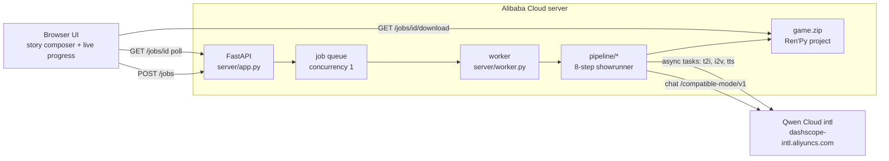

# AI Showrunner — type a story, download a playable film

**One premise in → one complete interactive video game out.** An autonomous
agent writes the screenplay, storyboards it into a branching scene graph,
generates a video clip for every scene, voices the protagonist's inner
monologue with burned-in subtitles, records a narrator intro, and assembles it
all into a ready-to-play [Ren'Py](https://www.renpy.org) visual-novel project —
end to end, powered entirely by **Qwen Cloud** models.

Built for the **Global AI Hackathon Series with Qwen Cloud** — track
**AI Showrunner** (AI-driven content production pipelines).

## What the agent produces

For any story premise (a single sentence is enough):

- a production-grade short **screenplay** (`qwen3.7-max`)
- a **branching scene graph** — real choices that fork into different scene
  chains and rejoin, validated for reachability, with durations fitted to a
  runtime budget
- a **keyframe** per scene (`wan2.2-t2i-flash`), style- and character-consistent
  via embedded appearance prompts + stable seeds
- a **video clip** per scene (`happyhorse-1.1-i2v`), with automatic fallback
  across models when a quota runs dry
- the protagonist's **first-person inner monologue**, TTS-voiced
  (`qwen3-tts-flash`) in a voice auto-matched to the character's gender, mixed
  into each clip with **synced burned-in subtitles**
- a **narrator voice** for the cinematic title intro
- a lint-checked **Ren'Py project**, zipped with play instructions

The web UI shows the screenplay and an **estimated media budget first** — the
agent asks before spending — then streams per-scene progress (frames appearing,
clips rendering, voices landing) until the download is ready.

## Architecture



Pipeline stages (each resumable — completed artifacts are skipped):

| Stage | Module | Model |
|---|---|---|
| 1. Screenplay | `pipeline/step1_expand.py` | `qwen3.7-max` |
| 2. Scene graph + branching | `pipeline/step2_scenes.py` | `qwen3.7-max` (JSON mode) |
| 3. Opening narration | `pipeline/step_intro.py` | `qwen3.7-max` |
| 4. Keyframes | `pipeline/step3_frames.py` | `wan2.2-t2i-flash` → `z-image-turbo` |
| 5. Video clips | `pipeline/step4_clips.py` | `happyhorse-1.1-i2v` → `wan2.6-i2v-flash` → `wan2.2-i2v-flash` |
| 6. Character monologue + SRT | `pipeline/step_monologue.py` | `qwen3.7-max` + `qwen3-tts-flash` |
| 7. Narrator voice | `pipeline/step6_voice.py` | `qwen3-tts-flash` |
| 8. Ren'Py assembly + lint | `pipeline/step5_renpy.py` | deterministic templates (no LLM) |

Chains (`→`) are automatic fallbacks: when a model is missing from the account
catalog or its quota is exhausted, the client hops to the next one and the job
keeps going.

## Quickstart (local CLI)

```bash
pip install -r requirements.txt
export DASHSCOPE_API_KEY=sk-...        # from home.qwencloud.com/api-keys

# sanity-check every model class against your account first:
python -m scripts.smoke_test

# cheap text-only preview (screenplay + scene graph, costs cents):
python -m pipeline.run_pipeline --idea examples/idea.txt --dry-run

# full build (~$2-6 of media depending on length):
python -m pipeline.run_pipeline --idea examples/idea.txt --target-seconds 90
```

Open `renpy_project/` in the [Ren'Py launcher](https://www.renpy.org/latest.html)
and play.

## Web service

```bash
uvicorn server.app:app --host 0.0.0.0 --port 8080
```

or with Docker (includes a headless Ren'Py SDK for linting):

```bash
cp .env.example .env    # put your DASHSCOPE_API_KEY inside
docker build -t showrunner .
docker run -d --restart unless-stopped -p 8080:8080 --env-file .env \
  -v $PWD/jobs:/app/jobs showrunner
```

Then open `http://localhost:8080`: type a premise → review the screenplay and
budget → approve → watch scenes render → download the game zip.

Each job is fully isolated under `jobs/<id>/` (fresh build + project dirs), so
concurrent stories never contaminate each other; jobs are garbage-collected
after 24 h.

## Deploying on Alibaba Cloud

The service is CPU-only (all generation is API-side), so a small
**Simple Application Server** is enough:

1. Create a SAS instance — Singapore, Ubuntu 22.04, 2 vCPU / 4 GB.
2. Firewall: open TCP 8080 (and 22 for yourself).
3. `apt install -y docker.io git`, add a 2 GB swapfile (ffmpeg headroom).
4. Clone this repo, `cp .env.example .env`, paste your API key.
5. `docker build -t showrunner . && docker run -d --restart unless-stopped -p 8080:8080 --env-file .env -v $PWD/jobs:/app/jobs showrunner`
6. Open `http://<public-ip>:8080`.

## Configuration

Everything lives in `pipeline/config.py`, env-overridable — notably
`LLM_MODEL`, `T2I_CHAIN`, `I2V_CHAIN`, `TTS_MODEL`/`TTS_API_STYLE`,
`TTS_VOICES_FEMALE`/`TTS_VOICES_MALE`, `WEB_MAX_TARGET_SECONDS`,
`WEB_MAX_SCENES`, `RENPY_EXE`. Run `python -m scripts.smoke_test` after
changing models.

## License

MIT — see [LICENSE](LICENSE).
