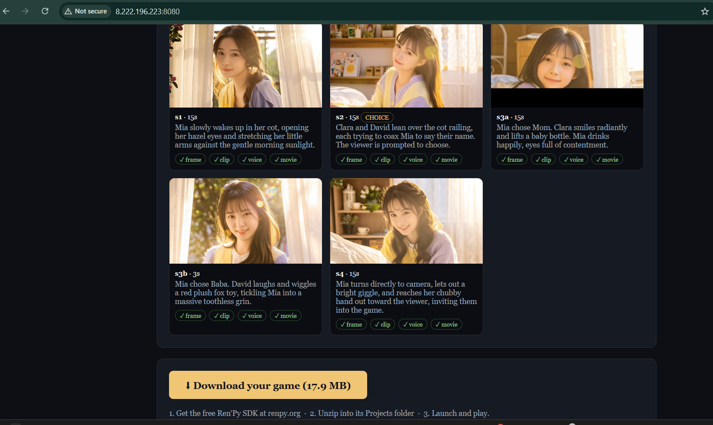
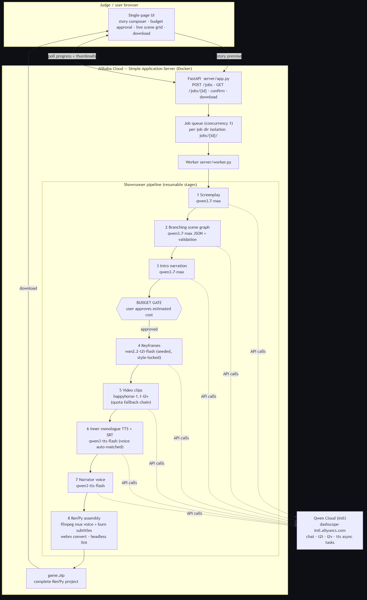
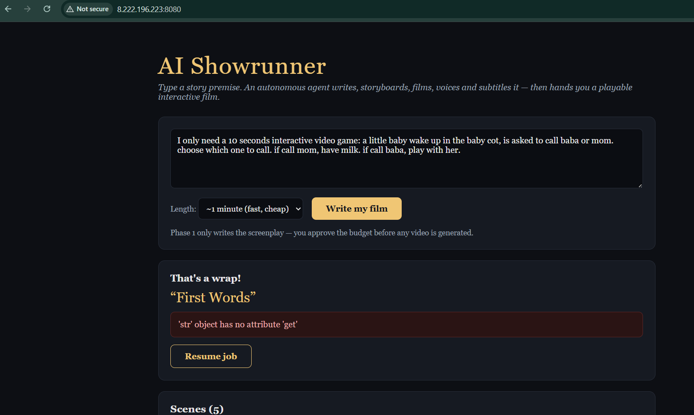

# Once Upon a Line

**An autonomous content-production agent that compiles a one-sentence story
premise into a complete, playable interactive film** — screenplay, branching
scene graph, generated video, character voice, synchronized subtitles, and a
packaged [Ren'Py](https://www.renpy.org) project — using Qwen Cloud models
end to end.

[](LICENSE)
[](https://www.python.org)
[](https://www.qwencloud.com)

Built for the **Global AI Hackathon Series with Qwen Cloud**, track
*AI Showrunner* (autonomous content-production pipelines).

**[▶ Demo video (Vimeo)](https://vimeo.com/1206942432)** · **[Sample output: *Static Tomorrow*](https://vimeo.com/1206950343)** · **[Sample output: *Same Pay, Different Pain*](https://vimeo.com/1206950581)**

[](https://vimeo.com/1206942432)

*The production console during a live run: per-scene keyframes, clip renders,
and voice tracks appear as the pipeline completes them. Input was a single
sentence; every frame shown is model-generated.*

---

## Overview

Producing an interactive film conventionally requires a writing, storyboard,
production, voice, and programming team. This project reduces that workflow to
a single autonomous agent with one human decision point: the user submits a
premise, reviews the generated screenplay and an estimated media budget, and
approves production. Everything else — from narrative structure to the final
lint-checked game build — is automated.

A complete run produces:

| Artifact | Produced by | Model |
|---|---|---|
| Production screenplay | `pipeline/step1_expand.py` | `qwen3.7-max` |
| Branching scene graph (validated) | `pipeline/step2_scenes.py` | `qwen3.7-max` (JSON mode) |
| Opening narration | `pipeline/step_intro.py` | `qwen3.7-max` |
| One keyframe per scene | `pipeline/step3_frames.py` | `wan2.2-t2i-flash` → `z-image-turbo` |
| One video clip per scene | `pipeline/step4_clips.py` | `happyhorse-1.1-i2v` → `wan2.6-i2v-flash` → `wan2.2-i2v-flash` |
| Protagonist inner monologue + SRT | `pipeline/step_monologue.py` | `qwen3.7-max` + `qwen3-tts-flash` |
| Narrator voice track | `pipeline/step6_voice.py` | `qwen3-tts-flash` |
| Assembled Ren'Py project + lint | `pipeline/step5_renpy.py` | deterministic templates (no LLM) |

Arrows denote automatic fallback chains (§ Design decisions).

## System architecture



```
Browser UI ──POST /jobs──▶ FastAPI ──▶ queue (concurrency 1) ──▶ worker
                                                                  │
                              Phase A: screenplay → scene graph → intro
                              [budget gate: user approves estimated cost]
                              Phase B: keyframes → clips → voice → mux → package
                                                                  │
                                      Qwen Cloud (dashscope-intl.aliyuncs.com)
                                      chat: OpenAI-compatible /compatible-mode/v1
                                      media: DashScope async tasks + polling
```

The web service (`server/`) wraps the pipeline (`pipeline/`); the pipeline is
also fully operable as a CLI, which serves as the debugging harness.

## Design decisions

**Two-phase execution with a budget gate.** Text generation (phase A) costs
cents; media generation (phase B) costs dollars. The worker pauses between
them at `awaiting_confirmation`, exposing the screenplay, characters, scene
table, and a cost estimate (`config.estimate_cost`). No media spend occurs
without explicit approval.

**Filesystem-derived progress and resumability.** Every stage writes durable
artifacts (`frames/<sid>_first.png`, `clips/<sid>.mp4`,
`monologue/<sid>_all.ogg`, `movies/<sid>.webm`). Job progress is computed by
scanning the job directory — the pipeline contains zero progress
instrumentation — and any failed job resumes from its last completed artifact.
Guards invalidate partial artifacts (e.g. zero-byte WebM files from an
interrupted mux) rather than resume-skipping them.

**Model registry with fallback chains.** All model identifiers live in
`pipeline/config.py` as ordered, environment-overridable chains. The client
(`pipeline/qwen_client.py`) distinguishes quota exhaustion and
model-unavailability from genuine errors and walks the chain, so a run
survives per-model free-tier ceilings and catalog differences between
accounts. `scripts/smoke_test.py` probes one call per model class and reports
the verified request shapes before any full run.

**Scene-graph validation and repair.** LLMs intermittently emit dangling scene
references (`next: "s3"` where the scene is `s3_choice`) and mis-shaped
entries (characters as bare strings). `step2_scenes.validate_and_fix`
normalizes shapes, fuzzy-repairs dangling links *before* reachability
analysis, prunes true orphans, enforces at least one real branch (two choices
with divergent targets) with a corrective retry, and rejects mostly
disconnected graphs rather than silently truncating the story.

**Per-job isolation.** `config.configure_job(job_dir)` re-derives every
pipeline path under `jobs/<id>/`, so concurrent stories can never share
artifacts. This eliminated an entire failure class (stale scene-id collisions
producing mismatched voice and subtitles).

**Deterministic game assembly.** The Ren'Py project is emitted by templates —
labels, movie cutscenes, and menus are generated code; only the prose comes
from the scene graph. Generated projects therefore always parse, verified by a
headless `renpy lint` in CI fashion at the end of every build.

**Consistency controls.** Character appearance is embedded into every frame
prompt alongside a global style block; keyframe seeds derive deterministically
from the protagonist's seed. Voices are selected programmatically from the
protagonist's gender and kept distinct from the narrator
(`pipeline/voices.py`). Character voice and subtitles are muxed directly into
each clip (`pipeline/media_utils.py`), timed from the measured duration of
each synthesized line.

## Sample outputs

Three genres from the same pipeline, each generated from one sentence:

| Title | Genre | Structure | Watch |
|---|---|---|---|
| *Static Tomorrow* | Supernatural thriller | 9 scenes, 2 branch points | [Vimeo](https://vimeo.com/1206950343) |
| *Same Pay, Different Pain* | Workplace comedy | 13 scenes, branching career paths | [Vimeo](https://vimeo.com/1206950581) |
| *First Words* | Family vignette | 6 scenes, 1 branch point | demo video |

| | |
|---|---|
|  *Model-generated frame (`wan2.2-t2i-flash` → `happyhorse-1.1-i2v`)* |  *A branch point in the packaged game; each option jumps to a different scene chain* |
|  *Job submission and status; failed jobs resume from the last completed artifact* |  *Start gate of the assembled Ren'Py project* |

## Getting started

### Prerequisites

- Python 3.11+
- A Qwen Cloud API key ([home.qwencloud.com/api-keys](https://home.qwencloud.com/api-keys)); pay-as-you-go keys (`sk-…`) target `dashscope-intl.aliyuncs.com`
- Optional: [Ren'Py SDK](https://www.renpy.org/latest.html) for lint and playback

### CLI

```bash
pip install -r requirements.txt
export DASHSCOPE_API_KEY=sk-...

# verify each model class against your account's catalog
python -m scripts.smoke_test

# text-only preview: screenplay + scene graph (costs cents)
python -m pipeline.run_pipeline --idea examples/idea.txt --dry-run

# full build (media cost typically $2–6 depending on length)
python -m pipeline.run_pipeline --idea examples/idea.txt --target-seconds 90
```

The assembled project is written to `renpy_project/` (or `--job-dir <dir>` for
an isolated build).

### Web service

```bash
uvicorn server.app:app --host 0.0.0.0 --port 8080
```

Or containerized (image includes a headless Ren'Py SDK for lint):

```bash
cp .env.example .env    # add DASHSCOPE_API_KEY
docker build -t showrunner .
docker run -d --restart unless-stopped -p 8080:8080 --env-file .env \
  -v "$PWD/jobs:/app/jobs" showrunner
```

API surface: `POST /jobs` · `GET /jobs/{id}` · `POST /jobs/{id}/confirm` ·
`GET /jobs/{id}/download`, with a static single-page client at `/`. Jobs are
garbage-collected after 24 h.

### Deployment (Alibaba Cloud)

The service is CPU-only — all inference is API-side — so an entry-level
instance suffices. Reference deployment: Simple Application Server, Singapore,
Ubuntu 22.04, 2 vCPU / ≥1 GB RAM with swap. `deploy/bootstrap.sh` provisions
Docker, a swapfile, the repository, and the running container in one step:

```bash
curl -fsSLo /tmp/bootstrap.sh \
  https://raw.githubusercontent.com/wiguo/ai-showrunner/master/deploy/bootstrap.sh
sudo bash /tmp/bootstrap.sh
```

Open TCP 8080 in the instance firewall.

## Configuration

All knobs live in `pipeline/config.py` and are environment-overridable:

| Variable | Default | Purpose |
|---|---|---|
| `LLM_MODEL` / `LLM_FALLBACKS` | `qwen3.7-max` / `qwen3-max,qwen-plus` | Story generation chain |
| `T2I_CHAIN` | `wan2.2-t2i-flash,z-image-turbo` | Keyframe chain (async task / sync multimodal shapes auto-selected) |
| `I2V_CHAIN` | `happyhorse-1.1-i2v,wan2.6-i2v-flash,wan2.2-i2v-flash` | Clip chain; quota exhaustion hops to the next entry |
| `TTS_MODEL` / `TTS_API_STYLE` | `qwen3-tts-flash` / `sync` | Voice synthesis model and API shape |
| `TTS_VOICES_FEMALE` / `TTS_VOICES_MALE` / `TTS_NARRATOR` | per-model roster | Voice selection pools |
| `WEB_MAX_TARGET_SECONDS` / `WEB_MAX_SCENES` | `150` / `12` | Hard cost caps for web-submitted jobs |
| `RENPY_EXE` | platform default | Ren'Py SDK path for headless lint |

## Repository layout

```
pipeline/          eight-stage generation pipeline + shared API client, media utils, voice selection
server/            FastAPI application, worker, job store, packaging, static UI
scripts/           smoke_test.py — per-model-class capability probe
deploy/            single-command server bootstrap
docs/              architecture diagram (source + render), screenshots, submission notes
examples/          sample story premise
```

## License

MIT — see [LICENSE](LICENSE).
